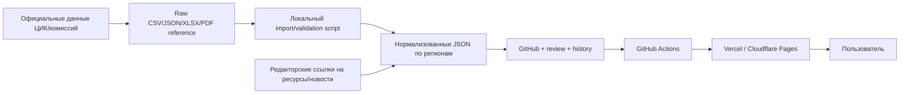

# Всероссийский каталог одномандатных округов — бесплатный MVP

**Статус:** целевая упрощенная спецификация  
**Охват:** все регионы, 225 одномандатных округов, все доступные кандидаты  
**Бюджет инфраструктуры:** 0 ₽/месяц, домен необязателен  
**Архитектура:** статический Next.js-сайт, данные в Git

---

## 1. Цель первой публичной версии

Создать всероссийский справочник, в котором пользователь может:

1. выбрать регион;
2. увидеть все одномандатные округа региона;
3. открыть округ;
4. увидеть всех кандидатов и их текущий известный официальный статус;
5. увидеть партию или самовыдвижение;
6. перейти на официальные/подтвержденные ресурсы кандидата;
7. открыть ссылки на связанные новости и публикации;
8. увидеть, когда сведения проверялись в последний раз.

Главный результат MVP — **полный базовый каталог**, а не глубокий AI-анализ риторики.

---

## 2. Приоритеты

### P0 — обязательно для запуска

- все регионы, участвующие в схеме округов;
- все 225 округов: номер, название, регион, официальное территориальное описание;
- все доступные кандидаты из официальных данных;
- различение `выдвинут`, `в заверенном списке`, `зарегистрирован`, `отказано`, `выбыл`, `статус уточняется`;
- партия или самовыдвижение;
- ссылка на официальный источник статуса;
- дата актуальности;
- страницы регионов, округов и кандидатов;
- поиск по ФИО, округу, номеру и региону;
- поля для сайта и социальных ресурсов кандидата;
- нейтральное пустое состояние, если ресурсы пока не найдены;
- ссылки на внешний поиск новостей по кандидату;
- методология и форма исправления.

### P1 — постепенно после запуска

- вручную подтвержденные личный сайт, Telegram, VK, другие публичные ресурсы;
- вручную отобранные новости и интервью;
- краткие statements с evidence;
- карта регионов;
- точные границы проверенных округов;
- регулярный полуавтоматический импорт официальных обновлений.

### Не входит в MVP

- автоматический рейтинг кандидатов;
- рекомендации за кого голосовать;
- прогноз результатов;
- sentiment-анализ новостей;
- автоматический фактчекинг;
- копирование полных новостных статей;
- автоматический массовый scraping социальных сетей;
- точный поиск округа по домашнему адресу;
- обязательные точные полигоны всех округов до проверки их происхождения.

---

## 3. Почему всероссийский охват помещается в бесплатную версию

Каталог из 225 округов и порядка нескольких тысяч кандидатов — небольшой для статического сайта объем.

Ориентировочная структура:

```text
1 главная страница
≈ 80–90 страниц регионов
225 страниц округов
≈ 1 000–2 000 страниц кандидатов
служебные страницы и методология
```

Текстовые данные и ссылки занимают мегабайты, а не гигабайты. Каждая страница генерируется при публикации и раздается через бесплатный CDN. База данных и постоянно работающий сервер не нужны.

---

## 4. Архитектура



### Бесплатные компоненты

- GitHub — repository, pull requests, issue tracker, CI;
- Next.js static export;
- Vercel Hobby, Cloudflare Pages или GitHub Pages;
- MapLibre только для региональной карты;
- MiniSearch/Fuse.js для клиентского поиска;
- Zod/JSON Schema для проверки данных;
- локальные import scripts на компьютере редактора.

Нет Supabase, backend, Redis, serverless API, AI API и платного geocoder.

---

## 5. Навигация

### Главная страница

- поиск по ФИО/округу/региону;
- список федеральных субъектов;
- простая карта регионов, если готов проверенный GeoJSON субъектов;
- дата последнего общего обновления;
- заметная ссылка на методологию.

### Страница региона

- название региона;
- список одномандатных округов;
- число кандидатов по каждому округу;
- дата проверки;
- предупреждение о неполноте, если официальный статус обновляется.

### Страница округа

- номер и официальное название;
- официальное текстовое описание территории;
- ссылка на первичный документ;
- список всех известных кандидатов;
- статус каждого кандидата на дату;
- партия/самовыдвижение;
- выбывшие кандидаты показываются отдельным блоком, а не удаляются.

### Страница кандидата

- ФИО;
- округ;
- партия/самовыдвижение;
- официальный статус и история изменений;
- дата проверки и ссылка на комиссию;
- подтвержденные ресурсы;
- вручную проверенные новости;
- внешние ссылки «Искать новости»;
- методологическая пометка о неполноте покрытия.

---

## 6. Данные и структура файлов

Данные разбиваются по регионам, чтобы браузер не загружал весь каталог сразу.

```text
data/
├─ election.json
├─ regions.json
├─ parties.json
├─ raw/
│  └─ 2026-08-14/
│     ├─ manifest.json
│     └─ source-files-or-references/
├─ regions/
│  ├─ 77-moscow/
│  │  ├─ region.json
│  │  ├─ districts.json
│  │  ├─ candidates.json
│  │  ├─ resources.json
│  │  └─ news.json
│  └─ ...
├─ geo/
│  ├─ regions.simplified.geojson
│  └─ districts-verified/
└─ schemas/
```

### `regions.json`

```json
[
  {
    "id": "77-moscow",
    "name": "Город Москва",
    "district_count": 16,
    "data_as_of": "2026-08-14"
  }
]
```

### `districts.json`

```json
[
  {
    "number": 207,
    "name": "Город Москва — Центральный одномандатный избирательный округ",
    "territory_description": "Официальное текстовое описание территории",
    "official_source": {
      "title": "Федеральный закон № 107-ФЗ",
      "url": "https://publication.pravo.gov.ru/Document/View/0001202505230011"
    },
    "geometry_status": "not_published",
    "data_as_of": "2026-08-14"
  }
]
```

### `candidates.json`

```json
[
  {
    "id": "official-stable-id-or-project-id",
    "full_name": "Фамилия Имя Отчество",
    "district_number": 207,
    "nomination_type": "party",
    "party_id": "party-slug",
    "status": "registered",
    "status_as_of": "2026-08-14",
    "official_source": {
      "title": "Сведения избирательной комиссии",
      "url": "https://example.invalid/replace-with-official-source",
      "accessed_at": "2026-08-14"
    }
  }
]
```

Допустимые статусы:

```text
nominated
certified_list
registered
registration_denied
registration_cancelled
withdrawn
lost_status
elected
not_elected
status_pending_verification
```

Сайт не должен называть кандидата зарегистрированным только потому, что он присутствует в заверенном партийном списке.

---

## 7. Ресурсы кандидатов

### Какие ссылки добавлять

- официальный личный сайт;
- официальная страница на сайте партии;
- Telegram;
- VK;
- Rutube/YouTube при доступности;
- другой публичный ресурс, принадлежность которого подтверждена.

### `resources.json`

```json
[
  {
    "candidate_id": "candidate-id",
    "type": "telegram",
    "title": "Официальный Telegram-канал",
    "url": "https://t.me/example",
    "verification_status": "verified",
    "verification_method": "linked_from_party_profile",
    "verified_at": "2026-08-14",
    "source_url": "https://example.invalid/party-profile"
  }
]
```

### Статусы подтверждения

- `verified_by_official_profile`;
- `verified_by_cross_links`;
- `claimed_not_verified`;
- `unverified_not_published`;
- `unavailable`.

Непроверенные ссылки не публикуются. Совпадения ФИО, фотографии или названия канала недостаточно.

Если ресурсов нет, показывать:

> На дату проверки редакция проекта не добавила подтвержденных ресурсов кандидата. Это не означает, что таких ресурсов не существует.

---

## 8. Новости: бесплатный и безопасный вариант

### 8.1. Первый слой — внешние поисковые ссылки

На каждой странице кандидата автоматически формируются ссылки:

- поиск новостей по точному ФИО;
- поиск по ФИО + регион;
- поиск по ФИО + номер округа.

Это обычные ссылки на поисковую выдачу. Сайт не копирует результаты и не отвечает за их содержание.

Чтобы уменьшить число однофамильцев, поисковая фраза должна включать регион или округ.

### 8.2. Второй слой — вручную проверенные новости

Редактор добавляет только metadata:

- заголовок;
- издатель;
- URL;
- дата публикации;
- дата проверки;
- тип материала;
- почему материал связан именно с этим кандидатом.

`news.json`:

```json
[
  {
    "id": "news-id",
    "candidate_id": "candidate-id",
    "title": "Заголовок публикации",
    "publisher": "Название издания",
    "url": "https://example.invalid/news",
    "published_at": "2026-08-10",
    "accessed_at": "2026-08-14",
    "material_type": "interview",
    "relation": "candidate_interview",
    "review_status": "approved"
  }
]
```

Полный текст статьи, изображения и превью-картинки не копируются. Это снижает объем, юридические риски и зависимость от хранилища.

### 8.3. Что не делать

- не собирать автоматически все совпадения по ФИО;
- не публиковать непроверенные автоматические подборки;
- не определять тональность;
- не сортировать кандидатов по количеству упоминаний;
- не считать отсутствие новостей отсутствием активности;
- не показывать обвинительный материал без ясной связи с кандидатом и источником.

### 8.4. Возможное развитие

После запуска можно подключить RSS только для разрешенных источников. Scheduled GitHub Action один раз в сутки формирует **черновик pull request**, но не публикует новости автоматически.

---

## 9. Импорт кандидатов

### Принцип

Официальный bulk-файл или выгрузка сохраняется как raw artifact либо получает manifest с URL, датой, размером и SHA-256. Локальный script создает нормализованные региональные JSON и diff.

```text
official file
  → raw manifest + checksum
  → parser
  → normalized records
  → schema validation
  → diff report
  → human review
  → Git commit
  → site rebuild
```

### Команды

```text
pnpm data:import --input <file> --observed-at YYYY-MM-DD
pnpm data:validate
pnpm data:diff --against main
pnpm build
```

### Требования

- import идемпотентен;
- исчезнувший upstream candidate не удаляется автоматически;
- изменение округа, партии или статуса попадает в critical diff;
- совпадение ФИО не используется как единственный identity key;
- raw source date и normalized build date различаются;
- parser version записывается в manifest;
- неизвестный новый формат останавливает импорт;
- сайт всегда показывает `data_as_of`.

До подтверждения стабильного официального endpoint импорт выполняется вручную из официально скачанного файла. Автоматический fetch можно добавить позже.

---

## 10. Карта

### Что делаем сразу

- карта субъектов России;
- клик по региону открывает страницу региона;
- округ можно найти по номеру, названию и текстовому списку.

### Что не блокирует запуск

Точные полигоны всех 225 округов. Закон содержит схему и описания, но это не гарантирует наличие официального машиночитаемого GeoJSON.

Если verified district geometry появляется:

- файл добавляется отдельно по региону;
- проходит проверку валидности и пересечений;
- включается point-in-polygon для этого региона;
- UI показывает происхождение и дату версии.

Если геометрии нет, страница округа остается полноценной благодаря официальному текстовому описанию и списку кандидатов.

---

## 11. Поиск

При сборке создаются небольшие региональные search indexes и общий индекс:

```json
{
  "candidates": [
    ["candidate-id", "нормализованное фио", 207, "77-moscow"]
  ],
  "districts": [
    [207, "центральный", "77-moscow"]
  ]
}
```

Поиск работает в браузере. Индекс загружается лениво и сжимается CDN. Результаты группируются: кандидаты, округа, регионы.

---

## 12. Проверки сборки

Production build падает, если:

- региональное число округов не совпадает с manifest;
- один district number встречается дважды;
- candidate ссылается на отсутствующий округ/партию;
- официальный статус не имеет URL и даты;
- `registered` получен из источника, помеченного только как партийный список;
- resource имеет непроверенный статус;
- news item не имеет издателя, даты или связи с кандидатом;
- опубликована запись с `example.invalid`;
- найден duplicate candidate ID;
- в публичных данных остался draft;
- в сумме отсутствует хотя бы один из 225 округов;
- checksum raw manifest не совпадает;
- реальный и synthetic dataset смешаны.

Отдельный coverage report показывает:

- округа без кандидатов;
- кандидатов без подтвержденных ресурсов;
- кандидатов без ручных новостей;
- записи старше заданного freshness threshold;
- кандидатов со статусом `status_pending_verification`.

Этот отчет оценивает полноту работы редакции, а не кандидатов.

---

## 13. Редакторский workflow

### Базовый официальный импорт

1. Data editor скачивает официальный файл.
2. Запускает import и получает diff.
3. Проверяет критические изменения.
4. Создает pull request.
5. Второй человек проверяет источник и totals.
6. После merge сайт обновляется.

### Ресурс или новость

1. Волонтер открывает issue по шаблону.
2. Указывает кандидата, URL и способ подтверждения.
3. Редактор проверяет принадлежность/связь.
4. Создает PR.
5. Reviewer подтверждает.

GitHub preview позволяет проверить страницу до публикации.

---

## 14. Этапы реализации

### Этап A — всероссийский каркас, P0

- регионы и все 225 округов;
- страницы регионов/округов;
- официальный source manifest;
- data validation;
- общий поиск;
- бесплатный deployment.

### Этап B — все кандидаты, P0

- parser официальной выгрузки;
- кандидаты, партии, статусы;
- candidate pages;
- diff и freshness report;
- ручная обработка конфликтов.

### Этап C — ресурсы и новости, P0/P1

- поля ресурсов;
- verification statuses;
- внешние поисковые ссылки для каждого кандидата;
- curated news JSON;
- issue/PR templates для волонтеров.

### Этап D — карта и улучшения, P1

- карта регионов;
- проверенные district polygons по мере готовности;
- statements для части кандидатов;
- RSS-to-draft PR для разрешенных источников.

---

## 15. Реалистичная трудоемкость

| Работа | Оценка одного человека с coding agent |
|---|---:|
| Каркас и статический deployment | 2–4 дня |
| Схемы, validators, страницы | 3–5 дней |
| Parser официального файла | 2–5 дней после получения формата |
| Поиск и региональная навигация | 1–3 дня |
| Импорт всех базовых кандидатов | 1–3 дня + разбор конфликтов |
| Проверка ресурсов всех кандидатов | недели/месяцы волонтерской работы |
| Curated news | постоянная редакционная работа |

Технически «все кандидаты + партии» несложно. Проверить личные ресурсы и новости для каждого кандидата — главный объем ручной работы.

---

## 16. Acceptance criteria первого всероссийского релиза

- опубликованы все 225 округов;
- каждый округ связан с регионом и официальным описанием/источником;
- импортированы все кандидаты из выбранного официального snapshot;
- стадия/статус кандидата названы точно;
- все кандидаты имеют party/self-nomination и `status_as_of`;
- выбывшие кандидаты не исчезают;
- поиск находит кандидата, округ и регион;
- каждая candidate page имеет внешние news-search links;
- непроверенные личные ресурсы не публикуются;
- curated news имеет только metadata и URL;
- сайт статический и не требует backend/database;
- production build проверяет completeness и provenance;
- весь сайт работает на бесплатном хостинге;
- UI честно показывает неполноту ресурсов/новостей;
- отсутствуют рейтинги, прогнозы и рекомендации.

---

## 17. Стартовая команда для Codex

> Реализуй `CIVIC_MAP_NATIONWIDE_FREE_MVP.md` как полностью статический всероссийский каталог на Next.js. Сначала создай synthetic dataset, имитирующий несколько регионов, но спроектируй schemas и маршруты для всех 225 округов и нескольких тысяч кандидатов. Реализуй региональные shards, страницы region/district/candidate, клиентский поиск, party/status/resource/news models, Zod validation, coverage report, GitHub Actions и static export. Не используй backend, Supabase, AI, geocoder и serverless functions. Добавь adapter interface и fixture parser для будущей официальной выгрузки; не выдумывай URL/формат ЦИК. Любой непроверенный resource, некорректный status или нарушение totals/provenance должно останавливать production build.

